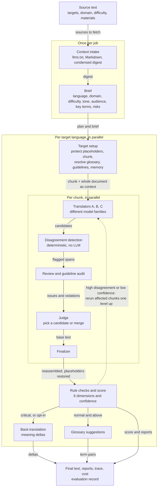

<div align="center">

# ExpertTranslateAI

**Translation run like a small agency: several models translate, argue, review and sign off,
in your browser, with your own key.**

[](https://github.com/HugoGresse/ExpertTranslateAI/actions/workflows/quality.yaml)
[](https://github.com/HugoGresse/ExpertTranslateAI/actions/workflows/security.yaml)
[](https://github.com/HugoGresse/ExpertTranslateAI/actions/workflows/deploy.yaml)


[**Open the app →**](https://hugogresse.github.io/ExpertTranslateAI/)

[Why](#why) · [How it works](#how-it-works) · [Methodology](#methodology) · [Run it](#run-it) · [Sources and references](#sources-and-references)

</div>

---

## Why

Ask one model to translate a document and it will usually do well. It will also, now and then,
drop a sentence, render a product name three different ways, turn "tu" into "vous" halfway
through, or change a number. Nothing tells you when this happens.

ExpertTranslateAI treats translation as a quality-control process instead of a single call. The
guiding idea comes from the project's original design notes: **build the system around quality
control and evaluation data, not around the number of models.** Effort scales with how hard the
text is, every step is visible, and every run leaves data you can learn from.

## Highlights

|                                                                                                                                         |                                                                                                                                          |
| --------------------------------------------------------------------------------------------------------------------------------------- | ---------------------------------------------------------------------------------------------------------------------------------------- |
| 🧭 **Adaptive effort.** A short UI string gets one model. A contract gets three translators, two reviewers, a judge and a back-translation. | 🔍 **Disagreement detection.** Candidates from different model families are compared sentence by sentence. Where they differ is where the reviewer looks first. |
| 📚 **Glossary, guidelines, memory.** Scoped glossaries, must / must-not rules and a translation memory are injected into every prompt and verified afterwards. | 📊 **Scored and explained.** Six quality dimensions, a confidence value, terminology and guideline reports, and the full trace of every call with its cost. |
| 🔁 **Learns from your edits.** Corrections become translation memory; recurring terms are proposed for the glossary; every run feeds an insights dashboard. | 🔐 **You own everything.** No backend. The key, materials and history stay in the browser. A CLI and an optional team server run the same engine. |

## How it works

Each run prepares the job once, then processes every target language in parallel. Inside a
target, every chunk goes through the same stages. What runs at each stage depends on the
difficulty.



### Effort scales with difficulty

The brief classifies the text, or you pick the difficulty yourself. Each level maps to a plan:

| Difficulty   | Translators | Reviewers | Guideline audit | Judge | Finalizer | Score | Back-translation |
| ------------ | :---------: | :-------: | :-------------: | :---: | :-------: | :---: | :--------------: |
| **simple**   |      1      |     –     |        –        |   –   |     –     |   –   |        –         |
| **normal**   |      2      |     1     |        ✓        |   –   |     ✓     |   ✓   |        –         |
| **hard**     |      3      |     1     |        ✓        |   ✓   |     ✓     |   ✓   |        –         |
| **critical** |      3      |     2     |        ✓        |   ✓   |     ✓     |   ✓   |        ✓         |

Deterministic glossary and guideline checks run at every level. Back-translation can be switched
on for any run.

### Escalation

A cheap plan is not a promise to stay cheap. With auto-escalation on (the default), the result of
the first pass is inspected and **only the affected chunks** are rerun one level up
(simple → normal → hard):

- any chunk where candidates disagree with **high** severity;
- when confidence falls below the threshold (60 by default): chunks with medium-severity
  disagreements, or every chunk if there are none;
- on `simple`, when the single model's output breaks a glossary or guideline rule.

Every escalation is recorded with its reason and stays inside the job's budget cap.

## Methodology

### 1. Prepare before translating

Borrowed from TransAgents' preparation stage and MAPS' "analyse the source first" strategy.

- **Context sources.** Add an `llms.txt` URL, any Markdown URL, an uploaded `.md` file or pasted
  text. `llms.txt` files are parsed (title, summary, sections, links), and the Markdown or text
  pages they link to are fetched too: a linked `llms-full.txt` alone when there is one, otherwise
  up to 25 pages (400k characters in total). A source larger than the
  context budget (4,000 tokens by default) is condensed once by a cheap model into a digest of
  what matters for translation (product names, domain terms, tone, what not to translate). The
  digest is cached by content hash, so reruns cost nothing until the source changes.
- **Brief.** One structured call detects the source language, domain (general, legal, technical,
  marketing, medical, literary, UI) and difficulty, and writes a summary, tone, audience, key
  terms and risks such as idioms, ambiguity, numbers and placeholders. Every later role sees it.

### 2. Protect, then chunk

- **Placeholders.** Fenced and inline code, URLs, `{{vars}}`, `{vars}`, `printf` specifiers and
  HTML tags are swapped for opaque `⟦PHn⟧` tokens before any model sees the text, restored at the
  end, and checked for parity.
- **Chunking** (from translation-agent). Texts over the chunk limit (1,000 tokens by default) are
  split into chunks of **even** size, breaking on paragraphs, then lines, sentences, clauses and
  words. Each chunk prompt carries the **whole document** with the current part wrapped in
  `<TRANSLATE_THIS>` tags, so no chunk is translated blind.

### 3. One shared world for every role

Every system prompt is assembled from the same ordered blocks, each capped by a token budget:

```text
role instructions → output contract → <BRIEF> → <CONTEXT> → <GUIDELINES> → <GLOSSARY> → <MEMORY> → task
```

Translators, reviewers, judge, finalizer and scorer therefore work from identical references.
Every prompt can be overridden per stage in Settings → Prompts, and a hash of the overrides is
stored with each evaluation so results stay comparable.

### 4. Terminology you control

| Material               | How it works                                                                                                                                                                                                                                                                                        |
| ---------------------- | --------------------------------------------------------------------------------------------------------------------------------------------------------------------------------------------------------------------------------------------------------------------------------------------------- |
| **Glossary**           | Entries are `preferred`, `forbidden` or `doNotTranslate`, organised in a scope tree **global → language → client → project → document**. The most specific scope wins; a forbidden rendering is never cancelled by a preferred one. CSV import and export.                                         |
| **Guidelines**         | Numbered rules of kind `must`, `must-not`, `prefer` and `keep` (a term that must appear verbatim). Rules with a regex pattern are also checked deterministically on the final text; the LLM audit reads every rule. A long style guide can be pasted and turned into discrete rules.                                              |
| **Translation memory** | Source sentences are matched against past pairs for the same language pair. Normalised exact matches are pinned as "reuse verbatim"; trigram similarity ≥ 85 % is offered as "adapt wording". The approach follows adaptive MT with fuzzy matches in context (Moslem et al., 2023).                |

### 5. Independent candidates, measured disagreement

Translators A, B and C run in parallel on each chunk. The model recommender picks them from
**different families** (Anthropic, OpenAI, Google, DeepSeek, Mistral…) so their disagreements
carry signal rather than shared blind spots.

Disagreement detection is a pure function. Candidates are split into sentences and aligned; a
sentence is flagged when the pairwise word-set similarity (Jaccard) drops below 0.7, and its
severity is classified:

| Severity   | Trigger                                                               |
| ---------- | --------------------------------------------------------------------- |
| **high**   | numbers, placeholders or a glossary term differ between candidates     |
| **medium** | fewer than half of the content words are shared                       |
| **low**    | wording only                                                          |

Flagged spans go to the reviewer ("examine these first") and drive escalation.

### 6. Critique, judgment, final edit

The trilateral pattern of TransAgents (action, critique, judgment), combined with
translation-agent's reflect-and-improve loop.

- **Reviewer** returns structured issues per candidate using MQM-style categories: accuracy,
  omission, addition, terminology, grammar, fluency, style, consistency, formatting, plus a
  preferred candidate. On `critical`, up to two different models review.
- **Guideline audit** checks each candidate against the numbered rules. `must`, `must-not` and
  `keep` violations are major; `prefer` violations are minor.
- **Judge** reads the candidates, issues and violations, then picks the best base or merges the
  best sentences into a new text.
- **Finalizer** starts from that base, applies the valid fixes, borrows wording from other
  candidates only where the review points to a problem, and keeps meaning complete.

### 7. Score and confidence

A scorer rates the final text from 0 to 100 on six dimensions, then two numbers are **computed**,
not asked for:

```math
\text{overall} = 0.30\,\text{fidelity} + 0.20\,\text{terminology} + 0.15\,\text{grammar} + 0.15\,\text{naturalness} + 0.10\,\text{register} + 0.10\,\text{consistency}
```

```math
\text{confidence} = 0.5 \cdot \text{scorer certainty} + 0.5 \cdot (40 + 60 \cdot \text{agreement}) - \min(40,\ 10 \cdot \text{unresolved major issues})
```

`agreement` is the mean pairwise word overlap between candidates of the same chunk, and
unresolved issues are the glossary and guideline violations still present after finalization.
A confident scorer cannot hide models that disagreed or rules that were broken.

### 8. Back-translation

For critical texts, or on request, a dedicated back-translator model translates the final text
back literally at temperature 0, then lists every place where meaning was lost, added or shifted. Round-trip
translation is a long-standing reference-free quality signal (Moon et al., 2020).

### 9. A loop that learns

- **Save as correction.** Edit the final text and save: changed sentences are written to the
  translation memory as human corrections and reused verbatim next time.
- **Glossary suggestions.** After a run, a helper model proposes source → target term pairs that
  are not in the glossary yet; pick the ones to add to a glossary scope.
- **Insights.** Each target writes an evaluation record (models, language, domain, difficulty,
  score, confidence, violations, escalations, cost, human edits). `/insights` groups them by
  translator, domain, language, difficulty or prompt version to show average score, cost per
  1,000 words, escalation rate and human-edit rate: which models and strategies actually work for
  your content.

### 10. Model choice

- **Recommender.** Economy, balanced and best presets pick a model per role from the live
  OpenRouter catalog: strong translators from different families under a price ceiling, a strong
  reviewer, judge and finalizer, cheap fast models for scoring, back-translation and helper tasks.
  Every role can be overridden.
- **Router.** A `domain → role → model` table, so legal texts can use a different judge than
  marketing copy.

### 11. Reliability and cost control

- Structured outputs are validated with zod; an invalid answer gets one repair retry at
  temperature 0.
- Rate limits and server errors retry with exponential backoff (up to 5 attempts) and honour
  `Retry-After`; key and credit errors fail fast.
- A concurrency limiter bounds the fan-out across languages, models and chunks.
- A cost estimate is shown before the run. The per-job budget cap counts spent cost plus the projected
  cost of calls in flight, and stops the run as soon as that passes the cap.
- Every call is traced with its role, model, prompt, raw output, tokens, cost and latency.
- A failing optional stage (review, score, back-translation, suggestions) degrades the result
  instead of failing the language.
- A run that stops midway (network error, credit ran out, cancel) offers **Retry**: only the
  unfinished languages run again, under the same job, and the finished ones are kept.

## Run it

### In the browser

Open [hugogresse.github.io/ExpertTranslateAI](https://hugogresse.github.io/ExpertTranslateAI/),
sign in with OpenRouter (OAuth PKCE) or paste a key, pick target languages and translate.

- **Workspace** `/` · **History** `/history` · **Glossary** `/glossary` · **Memory** `/memory` ·
  **Context** `/context` · **Guidelines** `/guidelines` · **Prompts** `/prompts` ·
  **Insights** `/insights` · **Settings** `/settings`
- Targets accept a region (`es-MX` is translated as "Spanish as spoken in Mexico"); Arabic,
  Hebrew, Persian and Urdu results render right to left.
- Opening a run from History shows it as it finished: brief, pipeline board with per-stage calls
  and cost, final text, score and suggestions. Saved corrections are kept on the stored result.
- Everything (glossary, guidelines, context, memory, history) exports and imports as one JSON
  file. The key is never exported.

### Command line

The CLI runs the exact same core through Node adapters, which is the proof that the engine has no
browser dependency. It needs Node 22.18 or newer and `OPENROUTER_API_KEY` in the environment.

```bash
OPENROUTER_API_KEY=sk-or-... npx eta translate README.md --to fr,es-MX --model deepseek/deepseek-v4-flash-0731 --out translated
```

Other commands: `eta models --filter claude`, `eta key`, and `eta import export.json` to load the
glossary, guidelines, context sources and translation memory exported from the web app's Settings
page. Materials and run history live in `$ETA_DATA_DIR` (default `~/.experttranslate`) as one JSON
file per table. Set `ETA_LOG_LEVEL=debug` for JSON-lines diagnostics on stderr; run `eta --help`
for every flag.

### Server mode

`apps/server` runs the same engine behind an HTTP endpoint so a team can share one OpenRouter key
without putting it in every browser:

```bash
OPENROUTER_API_KEY=sk-or-... ETA_SERVER_TOKEN=change-me ETA_ALLOWED_ORIGINS=https://you.github.io npx eta-server
```

The server refuses to start without `ETA_SERVER_TOKEN` unless `ETA_ALLOW_ANONYMOUS=true` is set,
and listens on `127.0.0.1:8787` by default (`ETA_HOST`, `PORT`). It enforces its own envelope on
every job regardless of what the client asks for:

| Variable               | Default | Effect                                        |
| ---------------------- | ------- | --------------------------------------------- |
| `ETA_MAX_BUDGET_USD`   | `5`     | budget cap per job, `none` to disable          |
| `ETA_MAX_SOURCE_CHARS` | `200000`| largest accepted source text                  |
| `ETA_MAX_JOBS`         | `4`     | jobs running at once, extra requests get 429  |
| `ETA_ALLOWED_MODELS`   | unset   | optional allow-list of model ids              |
| `ETA_PERSIST_JOBS`     | `false` | keep results in `ETA_DATA_DIR`                |

Jobs run against an in-memory store and nothing a client sends is written to disk unless
`ETA_PERSIST_JOBS=true`. Condensed digests of client contexts are cached in memory by content hash
so repeat jobs never pay the condense call twice. In the web app, Settings → Server takes the URL
and token; jobs are then posted to `/api/jobs` with only the materials they reference (active
glossary scopes, target-language entries and memory), progress streams back over SSE, and results
still land in the browser's history. The server URL and token are device configuration and are
never exported or imported. Put the server behind HTTPS before exposing it beyond localhost.

## Privacy and your key

- The OpenRouter key is stored in the browser's local storage on the device where you add it,
  optionally encrypted with a passphrase (PBKDF2-SHA-256, 200,000 iterations → AES-GCM 256).
- It is sent only in the `Authorization` header to `openrouter.ai`. The app has no analytics.
- Anyone with access to the browser profile can use a stored key: set a spending limit on it from
  your OpenRouter dashboard, and use "Forget key" in Settings to remove it.
- Context URLs are fetched directly from the browser. When a site blocks cross-origin requests,
  upload or paste the content instead; the app never routes your content through a third-party
  CORS proxy.

## Develop

```bash
npm install
npm run dev
```

Other scripts: `npm test`, `npm run lint` (Biome), `npm run lint:fix`, `npm run typecheck`,
`npm run build`, `npm run test:e2e -w apps/web` (Playwright, OpenRouter mocked).

Requires Node 22.18 or newer: the CLI and server run TypeScript directly through Node's built-in
type stripping. TypeScript 7 (native compiler) is used everywhere; `astro check` does not support
it yet, so the web app is type-checked with `tsc` after `astro sync` and `.astro` files are
validated by the build.

### Layout

```text
packages/core   engine: chunking, prompts, OpenRouter client, pipeline (pure TypeScript, runs in browser or Node)
apps/web        Astro + React UI, browser adapters (IndexedDB storage, key vault, PKCE auth)
packages/node   Node adapters shared by the CLI and the server (JSON file storage, fetch, stderr logger)
apps/cli        Node front end for the same engine (JSON file storage, stdin/stdout, web export import)
apps/server     HTTP server: server-held OpenRouter key, jobs streamed over SSE, bearer-token auth
```

The engine only talks to the outside world through injected ports (LLM, storage, fetch, clock,
logger, events), so the same pipeline runs against IndexedDB in the browser, JSON files in the CLI,
an in-memory store on the server, and a fake LLM in tests.

### Offline shell

Production builds register a service worker (`public/sw.js`, kept as plain JS because the static
build has no step to emit an un-hashed worker from TypeScript). It precaches the shell, serves
hashed assets cache-first and pages network-first with an offline fallback, so the app and your
IndexedDB data open without a network. Translation still needs OpenRouter. Dev and e2e runs never
register it.

### Deploy

Pushes to `main` build the site and publish it to GitHub Pages through
`.github/workflows/deploy.yaml`. The build reads `SITE_URL` and `BASE_PATH` so the same static
output works at a repository sub-path.

## Sources and references

### Design sources

The pipeline is a synthesis of three designs, detailed in [PLAN.md](PLAN.md):

1. **[Architecture cœur](Architecture%20c%C5%93ur.md)** (this repository, in French). Multi-model
   translation, specialised roles, adaptive orchestration, disagreement detection, multidimensional
   scoring, back-translation, glossary hierarchy, translation memory from human corrections, domain
   router and continuous evaluation.
2. **[andrewyng/translation-agent](https://github.com/andrewyng/translation-agent)**, Andrew Ng.
   Translate → reflect → improve loop, even chunking with the whole document as context, a
   country or region parameter, and reflection along accuracy, fluency, style and terminology.
3. **[TransAgents](https://github.com/minghao-wu/transagents)**, Minghao Wu et al. A preparation
   stage producing guidelines (glossary, summary, tone, audience) before translation; separate
   translator, localizer, proofreader and editor roles; action, critique and judgment as distinct
   steps; preference-based evaluation instead of BLEU.

### Where each technique comes from

| Technique in ExpertTranslateAI            | Origin                                                          | Code                                                   |
| ----------------------------------------- | --------------------------------------------------------------- | ------------------------------------------------------ |
| Brief before translating                  | TransAgents preparation stage; MAPS                             | `packages/core/src/pipeline/stages/brief.ts`           |
| Even chunks with whole-document context   | translation-agent                                               | `packages/core/src/text/chunk.ts`, `prompts/translate.ts` |
| Difficulty plans and escalation           | Architecture cœur §3                                            | `packages/core/src/pipeline/plan.ts`, `escalation.ts`  |
| Disagreement detection                    | Architecture cœur §4                                            | `packages/core/src/scoring/disagreement.ts`            |
| Review, judge, finalize                   | translation-agent reflect/improve; TransAgents; Self-Refine     | `packages/core/src/pipeline/stages/`                   |
| Issue categories                          | MQM error typology; GEMBA-MQM                                   | `packages/core/src/prompts/review.ts`                  |
| LLM scoring                               | GEMBA; LLM-as-a-judge                                           | `packages/core/src/pipeline/stages/score.ts`           |
| Confidence from agreement and violations  | Architecture cœur §5                                            | `packages/core/src/scoring/confidence.ts`              |
| Glossary injection and checks             | Architecture cœur §7–8; DiPMT                                   | `packages/core/src/glossary/`                          |
| Translation memory in the prompt          | Architecture cœur §9; Moslem et al.                             | `packages/core/src/tm/`                                |
| Back-translation deltas                   | Architecture cœur §6; round-trip QE                             | `packages/core/src/pipeline/stages/backTranslate.ts`   |
| Domain router and evaluation log          | Architecture cœur §10–11                                        | `packages/core/src/pipeline/router.ts`, `eval/`        |
| Context from `llms.txt`                   | llms.txt proposal                                               | `packages/core/src/context/llmsTxt.ts`, `crawl.ts`     |

### Research background

- Minghao Wu, Jiahao Xu, Yulin Yuan, Gholamreza Haffari, Longyue Wang, Weihua Luo, Kaifu Zhang.
  *(Perhaps) Beyond Human Translation: Harnessing Multi-Agent Collaboration for Translating
  Ultra-Long Literary Texts.* 2024, TACL. [arXiv:2405.11804](https://arxiv.org/abs/2405.11804)
- Zhiwei He, Tian Liang, Wenxiang Jiao, et al. *Exploring Human-Like Translation Strategy with
  Large Language Models* (MAPS). TACL 2024. [arXiv:2305.04118](https://arxiv.org/abs/2305.04118)
- Aman Madaan, Niket Tandon, Prakhar Gupta, et al. *Self-Refine: Iterative Refinement with
  Self-Feedback.* 2023. [arXiv:2303.17651](https://arxiv.org/abs/2303.17651)
- Tom Kocmi, Christian Federmann. *Large Language Models Are State-of-the-Art Evaluators of
  Translation Quality* (GEMBA). EAMT 2023. [arXiv:2302.14520](https://arxiv.org/abs/2302.14520)
- Tom Kocmi, Christian Federmann. *GEMBA-MQM: Detecting Translation Quality Error Spans with
  GPT-4.* WMT 2023. [arXiv:2310.13988](https://arxiv.org/abs/2310.13988)
- Lianmin Zheng, Wei-Lin Chiang, Ying Sheng, et al. *Judging LLM-as-a-Judge with MT-Bench and
  Chatbot Arena.* NeurIPS 2023 Datasets and Benchmarks. [arXiv:2306.05685](https://arxiv.org/abs/2306.05685)
- Yasmin Moslem, Rejwanul Haque, John D. Kelleher, Andy Way. *Adaptive Machine Translation with
  Large Language Models.* EAMT 2023. [arXiv:2301.13294](https://arxiv.org/abs/2301.13294)
- Marjan Ghazvininejad, Hila Gonen, Luke Zettlemoyer. *Dictionary-based Phrase-level Prompting of
  Large Language Models for Machine Translation* (DiPMT). 2023. [arXiv:2302.07856](https://arxiv.org/abs/2302.07856)
- Jihyung Moon, Hyunchang Cho, Eunjeong L. Park. *Revisiting Round-Trip Translation for Quality
  Estimation.* EAMT 2020. [arXiv:2004.13937](https://arxiv.org/abs/2004.13937)

### Standards and services

- [Multidimensional Quality Metrics (MQM)](https://themqm.org/): translation error typology.
- [llms.txt](https://llmstxt.org/): the format used for context sources.
- [RFC 7636](https://www.rfc-editor.org/rfc/rfc7636): PKCE, used for the OpenRouter sign-in.
- [BCP 47](https://www.rfc-editor.org/info/bcp47): language tags for sources and targets.
- [OpenRouter API](https://openrouter.ai/docs): chat completions, structured outputs, model
  catalog and pricing.
